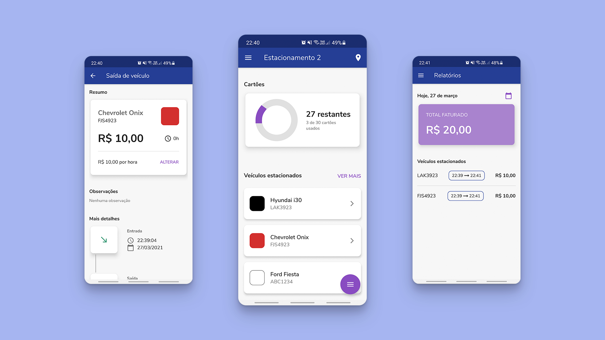

# All Parking

    </img>

## Description

An Android app to help managing parking lots. Created with Flutter & Dart.

### Features

- Vehicle check-in and check-out registration
- QR code generation for each spot in the parking lot
- Vehicle check-out and total price calculation with QR reader
- Manage employees and control their access

### Screenshots

    </img>

## Dependencies

- Firebase as a back-end service
  - Authentication
  - Firestore
  - Crashlytics
- `flutter_bloc` as a state management solution
- `dartz` for functional programming features, used mainly for clean error handling
- `freezed` for immutable classes, union and easy `json_serializable` classes generation
- `get_it` for a dependency injection system
- `kt_dart` for immutable Kotlin collections
- `rxdart` for a boost on Dart's native Streams API
- `shared_preferences` for data persistance

## Clean Architecture

Several Clean Architecture principles were followed in order to structure a maintainable and also testable application. A layered application and a proper file hierarchy allowed a separation of concerns and easy long-term maintenance.
